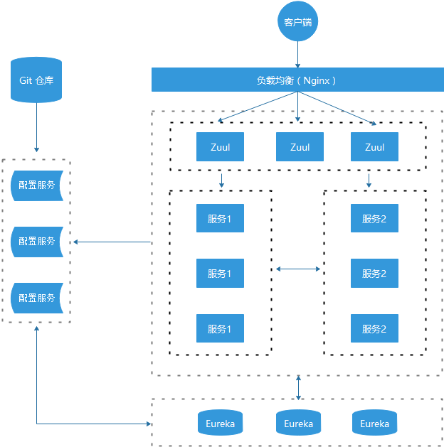

# Spring Cloud Netflix 学习

### 准备阶段

创建一个projects文件夹以供之后的项目添加


### 创建统一的依赖管理

Spring Cloud 项目都是基于 Spring Boot 进行开发，并且都是使用 Maven 做项目管理工具。在实际开发中，我们一般都会创建一个依赖管理项目作为 Maven 的 Parent 项目使用，这样做可以极大的方便我们对 Jar 包版本的统一管理。

在这一环节建了一个hello-spring-cloud-dependencies的文件夹来做其他子项目的依赖管理项目

### 创建服务注册中心
eureka服务注册中心的创建(hello-spring-cloud-eureka)，具体pom，以及配置的编写
### 创建服务提供者
...-service-admin

其中要在主类上加上@EnableEurekaClient声明自己是一个eureka客户端，注册服务的

然后yml文件的配置中，spring.application.name很重要，以后的服务间相互调用就是用的这个名字

打开服务注册中心，开启服务，刷新服务注册中心，可以看到已有服务注册进来了

### 创建服务消费者（Ribbon）
Ribbon 是一个负载均衡客户端，可以很好的控制 `http` 和 `tcp` 的一些行为。

configuration 里配置注入 RestTemplate 的bean，通过@LoadBalanced开启负载均衡功能（轮询，具体没有做研究）
### 创建服务消费者（Feign）
Feign 是一个声明式的伪 Http 客户端，它使得写 Http 客户端变得更简单。使用 Feign，只需要创建一个接口并注解。它具有可插拔的注解特性，可使用 Feign 注解和 JAX-RS 注解。Feign 支持可插拔的编码器和解码器。Feign 默认集成了 Ribbon，并和 Eureka 结合，默认实现了负载均衡的效果
- Feign 采用的是基于接口的注解
- Feign 整合了 ribbon

开发中使用feign

具体的使用参考service中的AdminService
### 使用熔断器防止服务雪崩
我们在分布式中保证高可用的n个9(99.999...%)服务的过程中，不可避免的就是服务出现问题，
如果单个服务出现问题，调用这个服务就会出现线程阻塞，此时若有大量的请求涌入，Servlet 容器的线程资源会被消耗完毕，导致服务瘫痪。
服务与服务之间的依赖性，故障会传播，会对整个微服务系统造成灾难性的严重后果，这就是服务故障的 “雪崩” 效应。

###### 为了解决这个问题，业界提出了熔断器模型。
Netflix 开源了 Hystrix 组件，实现了熔断器模式，Spring Cloud 对这一组件进行了整合。

较底层的服务如果出现故障，会导致连锁故障。当对特定的服务的调用的不可用达到一个阀值（Hystrix 是 5 秒 20 次） 熔断器将会被打开。

熔断器打开后，为了避免连锁故障，通过 `fallback` 方法可以直接返回一个固定值。
###### Ribbon 中使用熔断器
在` pom.xml` 中增加依赖
```xml
<dependency>
    <groupId>org.springframework.cloud</groupId>
    <artifactId>spring-cloud-starter-netflix-hystrix</artifactId>
</dependency>
```
在 Application 中增加 `@EnableHystrix` 注解   -- 参考`WebAdminRibbonApplication`--

在 Service 中增加 `@HystrixCommand` 注解
-- 在 Ribbon 调用方法上增加 `@HystrixCommand` 注解并指定 `fallbackMethod` 熔断方法 --
参考ribbon的service

###### Feign 中使用熔断器
Feign 是自带熔断器的，但默认是关闭的。需要在配置文件中配置打开它，在配置文件增加以下代码：
```yml
feign:
  hystrix:
    enabled: true
```
在 Service 中增加 fallback 指定类 (参考AdminService)

创建熔断器类(AdminServiceHystrix)并实现对应的 Feign 接口
### 使用熔断器仪表盘监控
在 Ribbon 和 Feign 项目增加 Hystrix 仪表盘功能，两个项目的改造方式相同

在 `pom.xml` 中增加依赖
```xml
<dependency>
    <groupId>org.springframework.cloud</groupId>
    <artifactId>spring-cloud-starter-netflix-hystrix-dashboard</artifactId>
</dependency>
```
在 Application 中增加 `@EnableHystrixDashboard` 注解

创建 `hystrix.stream` 的 Servlet 配置

测试 Hystrix Dashboard(
浏览器端访问 http://localhost:xxxx/hystrix)
### 使用路由网关统一访问接口
在微服务架构中，需要几个基础的服务治理组件，包括服务注册与发现、服务消费、负载均衡、熔断器、智能路由、配置管理等，由这几个基础组件相互协作，共同组建了一个简单的微服务系统。一个简单的微服务系统如下图：


在 Spring Cloud 微服务系统中，一种常见的负载均衡方式是，客户端的请求首先经过负载均衡（Zuul、Ngnix），再到达服务网关（Zuul 集群），然后再到具体的服。服务统一注册到高可用的服务注册中心集群，服务的所有的配置文件由配置服务管理，配置服务的配置文件放在 GIT 仓库，方便开发人员随时改配置。

遇到的坑：必须保证Spring Boot 和 Spring Cloud 的对应，否则这个zuul会报错。

路由的配置详见`hello-spring-cloud-zuul` 的project

当然还少不了路由失败之后的回调，在provider的包中有详细的配置
### 使用路由网关的服务过滤功能
之前我们了解到springcloud zuul包含了对请求的路由和过滤两个功能，其中路由功能负责将外部请求转发到具体的微服务实例上，是实现外
部访问统一入口的基础；而过滤器功能则负责对请求的处理过程进行干预，是实现请求校验，服务聚合等功能的基础。然而实际上，路由功能
在真正运行时，它的路由映射和请求转发都是由几个不同的过滤器完成的。其中，**路由映射主要通过pre类型的过滤器完成，它将请求路径与
配置的路由规则进行匹配，以找到需要转发的目标地址；而请求转发的部分则是由route类型的过滤器来完成，对pre类型过滤器获得的路由地
址进行转发。所以说，过滤器可以说是zuul实现api网关功能最核心的部件**，每一个进入zuul的http请求都会经过一系列的过滤器处理链得到
请求响应并返回给客户端。

需要注意的是在访问的时候就需要加入代码中设置的验证方式了，例如：http://localhost:8769/api/a/hi?msg=123&token=1

----
学习中发现了一个新的注解`@SpringCloudApplication`它整合了SpringBoot,发现eureka客户端,断路器hystrix三个注解

还有就是`@EnableDiscoveryClient`和`@EnableEurekaClient`现在直接使用前者就好了。两者前者功能更加的强大，需要了解详细的信息可以去搜索两者的区别

新增了关于api网关过滤的监控--这个只能监控通过路由的访问，对于直接访问自然监控不到